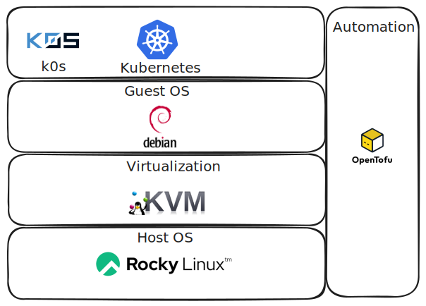

# Infra Lab
This project is designed as a hands-on learning experience to set up an on-premise Kubernetes cluster using KVM. It covers the deployment of core Kubernetes services and demonstrates how to automate infrastructure setup and application delivery using Infrastructure as Code (IaC) and GitOps principles, leveraging tools like Terraform and ArgoCD.

Every step of the process—from planning and designing the cluster architecture to manually configuring each component—has been carefully documented. These guides are available in the documentation section, making it easy for anyone to replicate and build their own home Kubernetes cluster.

## Directory Hierarchy

```
.
├── addons
│   └── bind9
├── docs
│   ├── assets
│   ├── getting-started
│   ├── storage
│   └── stylesheets
├── jarvis-kvm
│   ├── ansible
│   └── terraform
├── k0s
│   └── k0sctl.yaml
├── LICENSE
├── mkdocs.yml
├── README.md
└── requirements.txt
```

`.git-crypt`: contains gpg files of collaborators who can open encrypted git-crypt file.

`jarvis-kvm`: terraform code to provision VMs and other resources on top KVM hypervisor.

## Technology Stack

The following picture shows the high level components of opensource solutions used so far in the cluster, which installation process has been documented and its deployment has been automated with Open Tofu:

<p align="center">
  
</p>

<div class="d-flex">
<table class="table table-white table-borderer border-dark w-auto align-middle">
    <tr>
        <th></th>
        <th>Name</th>
        <th>Description</th>
    </tr>
    <tr>
        <td></td>
        <td><a href="https://argo-cd.readthedocs.io/en/stable/">ArgoCD</a></td>
        <td>GitOps tool</td>
    </tr>
    <tr>
        <td></td>
        <td><a href="https://cloudinit.readthedocs.io/en/latest/">Cloud-init</a></td>
        <td>Automate OS initial installation</td>
    </tr>
    <tr>
        <td></td>
        <td><a href="https://ceph.io/">Ceph</a></td>
        <td>Distributed Storage</td>
    </tr>
    <tr>
        <td></td>
        <td><a href="https://containerd.io/">Containerd</a></td>
        <td>Container runtime integrated with K0S</td>
    </tr>
    <tr>
        <td></td>
        <td><a href="https://www.tigera.io/project-calico">Calico</a></td>
        <td>Kubernetes Networking (CNI) and Load Balancer</td>
    </tr>
    <tr>
        <td></td>
        <td><a href="https://coredns.io/">CoreDNS</a></td>
        <td>Kubernetes DNS</td>
    </tr>
    <tr>
        <td></td>
        <td><a href="https://debian.org/">Debian</a></td>
        <td>Cluster nodes OS & Host OS</td>
    </tr>
    <tr>
        <td></td>
        <td><a href="https://kubernetes-sigs.github.io/external-dns/">ExternalDNS</a></td>
        <td>External DNS synchronization</td>
    </tr>
    <tr>
        <td></td>
        <td><a href="https://cert-manager.io">Cert-manager</a></td>
        <td>TLS Certificates management</td>
    </tr>
    <tr>
        <td></td>
        <td><a href="https://k0sproject.io/">K0S</a></td>
        <td> The simple, solid & certified Kubernetes distribution that works on any infrastructure</td>
    </tr>
    <tr>
        <td></td>
        <td><a href="https://linux-kvm.org/page/Main_Page">KVM</a></td>
        <td> Full virtualization solution for Linux on x86 hardware containing virtualization extensions (Intel VT or AMD-V)</td>
    </tr>
    <tr>
        <td></td>
        <td><a href="https://metallb.io/">MetalLB</a></td>
        <td>Load-balancer implementation for bare metal Kubernetes clusters</td>
    </tr>
</table>
</div>