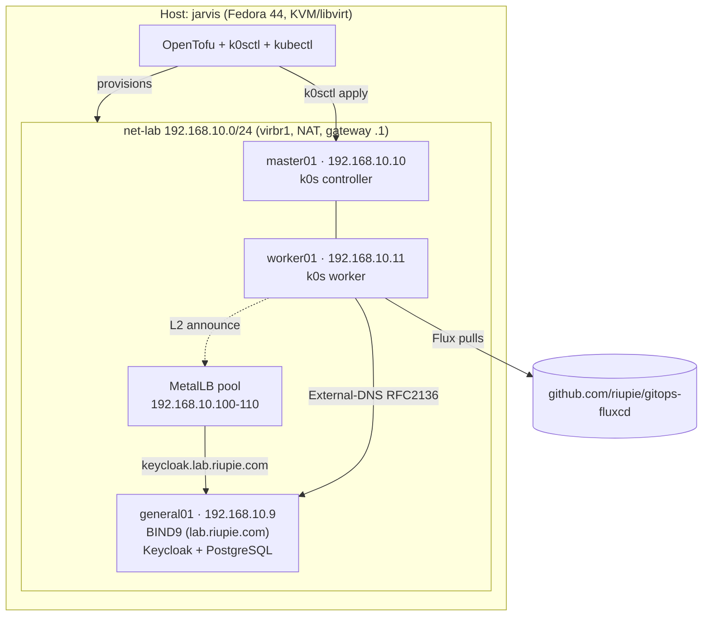

# Lab Architecture

This page describes the lab as it runs today: one KVM host, one libvirt NAT network and three VMs. A single-node k0s cluster runs on two of them, and the third provides DNS and identity.

## Overview

## Host

| Item | Value |
|---|---|
| Hostname | `jarvis` |
| OS | Fedora 44 |
| CPU | AMD Ryzen 7 9700X (8 cores / 16 threads) |
| Memory | 32 GB |
| Virtualization | KVM, libvirt 12 (`qemu:///system`), storage pool `default` at `/var/lib/libvirt/images` |
| Tools | OpenTofu, k0sctl, kubectl, flux; the kube context is `lab-cluster` |

The host resolves `lab.riupie.com` through general01 using a systemd-resolved routing domain on `virbr1`. See [Set Up Dynamic DNS, step 8](../playbooks/dynamic-dns.md#8-optional-resolve-the-lab-zone-from-the-fedora-host).

## Network

| Network | Bridge | Subnet | Mode | Gateway / DHCP |
|---|---|---|---|---|
| `net-lab` | `virbr1` | `192.168.10.0/24` | NAT | `192.168.10.1` (libvirt dnsmasq); VMs use static IPs |

| Direction | Source → destination | Allowed |
|---|---|---|
| Outbound | VMs → internet (NAT through the host) | Yes |
| Internal | VM ↔ VM, host ↔ VMs | Yes |
| Inbound | LAN → VMs | No (NAT) |

Address plan:

| Range | Use |
|---|---|
| `192.168.10.1` | Host / libvirt gateway and DNS forwarder |
| `192.168.10.9–11` | VMs (static, set in `jarvis-kvm/terraform/vm/main.tf`) |
| `192.168.10.100–110` | MetalLB `IPAddressPool` `lb-pool` (L2); `192.168.10.100` is the agentgateway `Gateway` |

## Virtual machines

All VMs use the Debian 12 genericcloud image. SSH user: `cloud`.

| VM | IP | vCPU | Memory | Disk | Role |
|---|---|---|---|---|---|
| **general01** | `192.168.10.9` | 1 | 2 GB | 20 GB | BIND9 authoritative/recursive DNS for `lab.riupie.com`; Keycloak + PostgreSQL (Docker Compose) |
| **master01** | `192.168.10.10` | 2 | 4 GB | 50 GB | k0s controller (control plane only; not listed in `kubectl get nodes`) |
| **worker01** | `192.168.10.11` | 2 | 8 GB | 50 GB | k0s worker; runs all cluster workloads |

## Services

### general01

| Service | Details | Guide |
|---|---|---|
| BIND9 | Zone `lab.riupie.com`, forwards to `192.168.10.1`, TSIG dynamic updates for External-DNS | [Set Up Dynamic DNS](../playbooks/dynamic-dns.md) |
| Keycloak | Realm `mcp`, exposed as `https://keycloak.lab.riupie.com` through the gateway | [Secure MCP Servers with OAuth](../playbooks/mcp-oauth.md) |

### Kubernetes (`lab-cluster`)

k0s with Calico (CNI) and kube-proxy in IPVS mode. k0sctl installs only flux-operator; everything else is reconciled by Flux from [`riupie/gitops-fluxcd`](https://github.com/riupie/gitops-fluxcd) (`clusters/development`):

| Add-on | Purpose |
|---|---|
| MetalLB | LoadBalancer IPs from `lb-pool` |
| cert-manager | TLS certificates |
| External-DNS | Publishes Gateway/HTTPRoute hostnames to BIND9 on general01 |
| External Secrets, Sealed Secrets | Secret delivery |
| agentgateway | Gateway API implementation, MCP and AI traffic (`gateway-ai`) |

## Minimum host requirements

The VMs need 5 vCPUs, 14 GB RAM and about 120 GB of disk in total (qcow2 is thin-provisioned, but plan for the full size).

| Component | Minimum | Recommended |
|---|---|---|
| CPU | 4 cores with VT-x/AMD-V | 8+ cores |
| Memory | 24 GB | 32 GB+ |
| Storage | 150 GB SSD | 250 GB+ NVMe |
