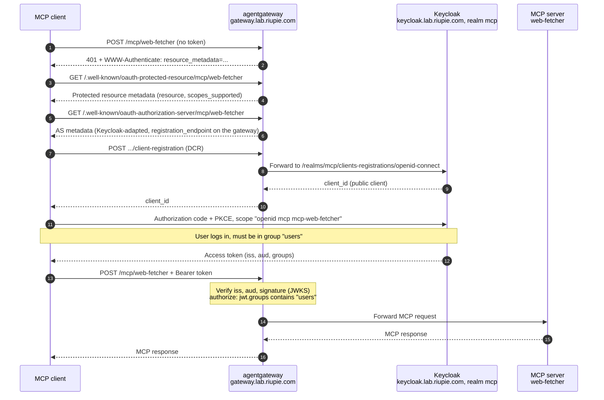

# Secure MCP servers with Keycloak OAuth

This playbook puts JWT authentication and group-based authorization in front of MCP servers behind agentgateway, and lets MCP clients self-register in Keycloak via Dynamic Client Registration (DCR) instead of pre-provisioned clients.

Use it when exposing a new MCP server through `gateway-ai`, or when rebuilding the Keycloak realm/scopes. It is not needed for MCP servers that are cluster-internal only.

Stack: agentgateway chart `v1.6.0`, Keycloak 26.x, Flux · Target: realm `mcp`, gateway `gateway-ai` (ns `gateway-system`), kube context `lab-cluster` · Env: lab

## Prerequisites

- [ ] Keycloak reachable at `https://keycloak.lab.riupie.com` (runs on general01 from `/opt/keycloak` with Docker Compose, exposed through the gateway), realm `mcp` exists. Check the version in the console (Help → Server info); the UI paths below are from Keycloak 26.x.
- [ ] Gateway `gateway-ai` (ns `gateway-system`) serving host `gateway.lab.riupie.com`: `kubectl --context lab-cluster -n gateway-system get gateway gateway-ai`
- [ ] Upstream MCP server deployed, e.g. `mcp-website-fetcher` (ns `mcp-server`), path `/mcp/web-fetcher`
- [ ] Access to the `riupie/gitops-fluxcd` repo: manifests live under `apps/development/mcp-website-fetcher/` and are deployed by Flux; this page documents the Keycloak and gateway setup behind them
- [ ] On the Fedora host: `*.lab.riupie.com` resolves (see [Dynamic DNS step 8](dynamic-dns.md#8-optional-resolve-the-lab-zone-from-the-fedora-host)), and `curl`/`jq` are installed (`sudo dnf install -y jq`)

## Steps

### 1. Review the model



Token contract the policy depends on:

| Claim | Value | Produced by |
|---|---|---|
| `iss` | `https://keycloak.lab.riupie.com/realms/mcp` | realm (frontend URL) |
| `aud` | `https://gateway.lab.riupie.com/mcp/web-fetcher` | audience mapper in scope `mcp-web-fetcher` |
| `groups` | `["users"]` | group-membership mapper in scope `mcp` |

Design: **one audience per MCP server**, so a token for server A is rejected by server B. `mcp` is a *Default* scope (every DCR client gets `groups`); `mcp-<server>` scopes are *Optional* (a client requests only the scope the route advertises).

### 2. Create the group and user

*Keycloak console, realm `mcp`:*

1. Groups → **Create group** → `users`.
2. Users → **Add user**: username, email, first/last name → Create.
3. User → **Credentials** → Set password (Temporary OFF).
4. User → **Groups** → Join group → `users`.

### 3. Create the shared scope `mcp` (groups claim)

1. Client scopes → **Create client scope**
    - Name `mcp`, Type **Default**, Protocol OpenID Connect
    - Display on consent screen ON, **Include in token scope** ON, Include in OpenID Provider Metadata ON
2. `mcp` → Mappers → **Configure a new mapper** → **Group Membership**
    - Name `groups`, Token claim name `groups`
    - **Full group path OFF** (the claim must be `users`, not `/users`)
    - Add to ID token OFF, access token ON, introspection ON, userinfo ON

### 4. Create the per-server scope `mcp-web-fetcher` (audience)

1. Client scopes → **Create client scope**
    - Name `mcp-web-fetcher`, Type **Optional**, Protocol OpenID Connect
    - **Include in token scope** ON, Include in OpenID Provider Metadata ON
2. Mappers → **Configure a new mapper** → **Audience**
    - Name `web-fetcher-audience`
    - Included Client Audience: *(empty)*
    - **Included Custom Audience**: `https://gateway.lab.riupie.com/mcp/web-fetcher`
    - Add to access token ON, introspection ON, ID token OFF

Custom Audience is a free string. "Included Client Audience" would require a Keycloak client with that exact clientId.

!!! tip "Adding another MCP server"
    For a server `foo`, repeat this step with scope `mcp-foo` and audience `https://gateway.lab.riupie.com/mcp/foo`, then add `mcp-foo` to Allowed Client Scopes (step 5).

### 5. Configure client registration policies (DCR)

Clients → **Client registration** tab → **Anonymous access policies**.

| Policy | Setting |
|---|---|
| **Allowed Client Scopes** | Allowed scopes: `openid`, `email`, `mcp-web-fetcher` (one per server). *Allow Default Scopes* ON auto-allows `mcp`. |
| **Trusted Hosts** | **Host Sending Registration Request Must Match: OFF** (IP check disabled). **Client URIs Must Match: ON**. Trusted Hosts: `localhost`, `127.0.0.1` (add `*.lab.riupie.com` etc. for web clients). |
| **Full Scope Disabled** | Keep (strips role mappings from new clients). |
| **Max Clients Limit** | Lower from the default (e.g. 50) to bound anonymous registrations. |

Why the source-IP check is off: Keycloak is behind agentgateway, so it sees the gateway/pod address (or the real client IP via `X-Forwarded-For`, depending on `--proxy-headers`), never a stable, knowable client address. With the IP check off, registration is still constrained by *Client URIs Must Match* (redirect hosts limited to the trusted list), Allowed Client Scopes, Full Scope Disabled and Max Clients Limit.

If you re-enable the IP check and get 403, the rejected host is in the Keycloak server log; add the gateway address (`192.168.10.100` LB IP, or the node/pod IP Keycloak sees).

### 6. Check realm settings

- Realm settings → General → **Frontend URL**: leave empty if the public hostname is already derived correctly. The discovery `issuer` must equal `https://keycloak.lab.riupie.com/realms/mcp` exactly (checked in [Verify 1](#1-keycloak-discovery)).
- Do **not** attach `microprofile-jwt` to DCR clients: it writes realm roles into a `groups` claim and collides with the group mapper.

### 7. Configure agentgateway / Kubernetes

Files (in `gitops-fluxcd`): `apps/development/mcp-website-fetcher/`

| File | Purpose |
|---|---|
| `service.yaml` | `appProtocol: agentgateway.dev/mcp` |
| `backend.yaml` | `AgentgatewayBackend` with an MCP target |
| `httproute.yaml` | Routes `/mcp/web-fetcher` **and both** `/.well-known/oauth-*/mcp/web-fetcher` paths to the backend |
| `policy.yaml` | `AgentgatewayPolicy`: JWT validation, MCP resource metadata, tool authZ |

Key `policy.yaml` fields:

```yaml
traffic:
  jwtAuthentication:
    mode: Strict
    providers:
      - issuer: https://keycloak.lab.riupie.com/realms/mcp
        audiences: [https://gateway.lab.riupie.com/mcp/web-fetcher]   # must equal the audience mapper value
        jwks:
          remote:
            url: https://keycloak.lab.riupie.com/realms/mcp/protocol/openid-connect/certs
    mcp:
      provider: Keycloak
      resourceMetadata:
        resource: https://gateway.lab.riupie.com/mcp/web-fetcher     # canonical URL of this MCP server
        scopesSupported: [openid, mcp, mcp-web-fetcher]              # what clients will request
        bearerMethodsSupported: [header]                             # no tokens in body/query
backend:
  mcp:
    authorization:
      action: Allow
      policy:
        matchExpressions:
          - 'has(jwt.groups) && jwt.groups.exists(group, group == "users")'
```

!!! warning "Consistency rules (the usual failure points)"
    - `issuer` == discovery `issuer` == token `iss` (scheme, host, realm path; no trailing slash).
    - `audiences` == audience mapper "Included Custom Audience" (exact string).
    - `scopesSupported` contains the per-server scope; otherwise DCR clients never request it and get no `aud`.
    - The HTTPRoute includes the `.well-known` paths; otherwise discovery returns `404 route not found` and DCR never starts.
    - The gateway can reach `keycloak.lab.riupie.com` and trusts its certificate, to fetch JWKS.

Roll out through Flux (commit → push → reconcile):

```bash
flux --context lab-cluster reconcile kustomization apps --with-source   # adjust to your Kustomization name
kubectl --context lab-cluster -n mcp-server get agentgatewaypolicy,httproute
```

## Verify

Run these on the Fedora host.

### 1. Keycloak discovery

```bash
curl -s https://keycloak.lab.riupie.com/realms/mcp/.well-known/openid-configuration \
  | jq '{issuer, jwks_uri, registration_endpoint, code_challenge_methods_supported, scopes_supported}'
```

Expected: `issuer` is exactly `https://keycloak.lab.riupie.com/realms/mcp`, and `scopes_supported` lists `mcp` and `mcp-web-fetcher`.

### 2. Gateway behaviour

```bash
# unauthenticated: 401 + WWW-Authenticate with resource_metadata
curl -si -X POST https://gateway.lab.riupie.com/mcp/web-fetcher | head
# protected-resource metadata
curl -s https://gateway.lab.riupie.com/.well-known/oauth-protected-resource/mcp/web-fetcher | jq
# authorization-server metadata: registration_endpoint points at the gateway's .../client-registration
curl -s https://gateway.lab.riupie.com/.well-known/oauth-authorization-server/mcp/web-fetcher | jq
```

### 3. DCR

This creates a client in Keycloak; delete it afterwards (see [Rollback](#rollback)).

```bash
curl -s -X POST https://keycloak.lab.riupie.com/realms/mcp/clients-registrations/openid-connect \
  -H 'Content-Type: application/json' \
  -d '{"client_name":"dcr-test","redirect_uris":["http://localhost:8080/callback"],
       "token_endpoint_auth_method":"none","scope":"openid mcp mcp-web-fetcher"}' | jq
```

Expected: in the console, the new client's **Client scopes** tab shows `mcp` as Default and `mcp-web-fetcher` as Optional.

### 4. End to end

Connect with a real client (MCP Inspector, or Claude Code: `claude mcp add --transport http web-fetcher https://gateway.lab.riupie.com/mcp/web-fetcher`) and complete the login. Then decode the access token (JWTs are base64url, hence the `gsub`):

```bash
jq -R 'split(".")[1] | gsub("-";"+") | gsub("_";"/") | @base64d | fromjson' <<<"$TOKEN"
```

Expected: `iss`, `aud` and `groups` match the token contract in step 1, and `scope` contains `mcp mcp-web-fetcher`.

## Troubleshooting

| Symptom | Likely cause | Fix |
|---|---|---|
| `404 route not found` on `.well-known` | HTTPRoute change not committed/reconciled | Commit, then reconcile through Flux (step 7) |
| 401 `JWT token required` after login | Token has wrong `aud` (mapper value ≠ policy `audiences`) or `iss` mismatch | Make `audiences` equal the audience mapper value and `issuer` equal the discovery `issuer` (step 7 consistency rules) |
| 403 / tool call denied | `groups` missing or not `users`: `mcp` scope not Default, mapper "Full group path" ON, user not in group | `mcp` Default, Full group path OFF, user in group `users` (steps 2–3) |
| DCR 403 | Trusted Hosts (source IP or redirect host), or requested scope not in Allowed Client Scopes | Adjust the DCR policies (step 5) |
| Token has no `mcp-web-fetcher` | Client didn't request the scope | Add the scope to `scopesSupported` (step 7) and Allowed Client Scopes (step 5) |
| Gateway logs a JWKS fetch error | Gateway can't resolve/trust `keycloak.lab.riupie.com` | Ensure the gateway can reach and trust the Keycloak host (step 7) |

## Rollback

- Gateway: `git revert` the policy/route commit in `gitops-fluxcd`, push, and reconcile (step 7). The MCP server is then unauthenticated again, or unreachable if the route itself is reverted.
- Keycloak: delete client scopes `mcp` and `mcp-web-fetcher` and any `dcr-test` clients. Nothing else depends on them.

## References

- [MCP authorization specification](https://modelcontextprotocol.io/specification/latest/basic/authorization)
- [Keycloak client registration](https://www.keycloak.org/securing-apps/client-registration)
- [agentgateway documentation](https://agentgateway.dev/docs/)
