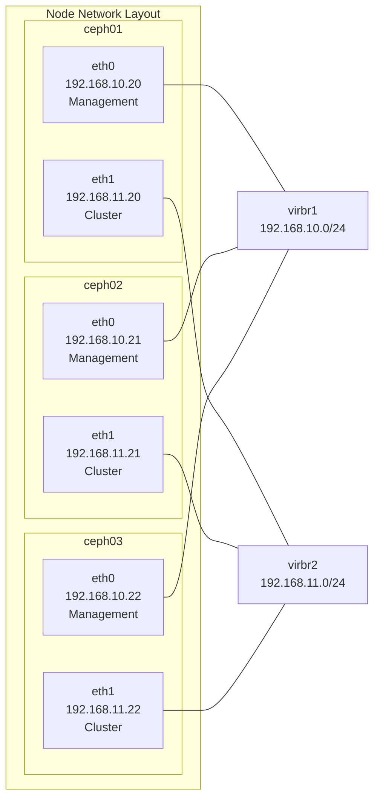

# Ceph Deployment Guide

## Overview

This guide provides step-by-step instructions for deploying the Ceph storage cluster using Ansible automation. The deployment process is organized into logical phases for better control and troubleshooting.

## Prerequisites

### **Infrastructure Requirements**

| Component | Specification |
|-----------|---------------|
| **Nodes** | 3x Virtual Machines (ceph01, ceph02, ceph03) |
| **Memory** | 8GB per node |
| **vCPUs** | 2 per node |
| **System Disk** | 50GB per node |
| **OSD Disk** | 100GB per node (/dev/vdb) |
| **DB Disk** | 50GB per node (/dev/vdc) |
| **Network** | Dual NICs per node |

### **Network Configuration**



### **Software Prerequisites**

| Software | Version | Purpose |
|----------|---------|---------|
| **Ansible** | 2.12+ | Automation platform |
| **Python** | 3.8+ | Ansible dependency |
| **Collections** | ceph.automation, community.general, ansible.posix | Required collections |

## Pre-Deployment Setup

### **1. Prepare Ansible Environment**

```bash
# Install Ansible and collections
pip3 install ansible
ansible-galaxy install -r requirements.yaml

# Verify collections
ansible-galaxy collection list | grep -E "(ceph|community|ansible)"
```

### **2. Test connectivity**

```bash
# Go to ansible directory
cd jarvis-kvm/ansible

# Test connectivity
ansible all -i inventories/development/hosts.yaml -m ping
```

### **3. Validate Infrastructure**

```bash
# Verify disk layout
ansible all -i inventories/development/hosts.yaml -m shell -a "lsblk"

# Check network interfaces
ansible all -i inventories/development/hosts.yaml -m shell -a "ip addr show"
```

## Deployment Process

The deployment follows a phased approach for reliability and debugging:

### **Phase 1: Pre-flight and Preparation**
```bash
# Configure /etc/hosts for internal communication
ansible-playbook -i inventories/development/hosts.yaml site.yaml --tags preflight
```

**What this does:**
- Configures `/etc/hosts` with cluster node mappings
- Sets up internal DNS resolution
- Prepares network communication
- Adds Ceph community repository
- Installs cephadm, podman, chrony, firewalld
- Configures time synchronization
- Sets up container runtime

### **Phase 2: Cluster Bootstrap**

```bash
# Bootstrap initial cluster on admin node
ansible-playbook -i inventories/development/hosts.yaml site.yaml --tags bootstrap
```

**Bootstrap Process:**
1. **Initialize cluster** on ceph01 with specified FSID
2. **Configure networks** (public: 192.168.10.0/24, cluster: 192.168.11.0/24)
3. **Enable dashboard** with admin credentials
4. **Apply base configuration** settings

**Expected Output:**
```bash
# Verify bootstrap success
ansible admin -i inventories/development/hosts.yaml -b -m shell -a "ceph -s"
```

### **Phase 3: Cluster Expansion**

```bash
# Distribute cephadm SSH keys between nodes and add all nodes to cluster with appropriate labels
ansible-playbook -i inventories/development/hosts.yaml site.yaml --tags add_nodes
```

**Node Labels Applied:**
- **ceph01**: `_admin`, `mon`, `mgr`, `osd`, `rgw`
- **ceph02**: `mon`, `mgr`, `osd`, `rgw`
- **ceph03**: `mon`, `mgr`, `osd`, `rgw`

### **Phase 4: Service Deployment**

#### **Step 4.1: Core Services**
```bash
# Deploy MON, MGR, and RGW services
ansible-playbook -i inventories/development/hosts.yaml site.yaml --tags deploy_services
```

**Services Deployed:**
- **3x MON**: Cluster state management
- **3x MGR**: Cluster management and dashboard
- **3x RGW**: Object storage gateway

#### **Step 4.2: OSD Deployment**
```bash
# Configure and deploy Object Storage Daemons
ansible-playbook -i inventories/development/hosts.yaml site.yaml --tags configure_osds
```

**OSD Configuration:**
- **Data Device**: `/dev/vdb` (100GB per node)
- **DB Device**: `/dev/vdc` (50GB per node)
- **Total OSDs**: 6 (2 per node)

### **Phase 5: Storage Configuration**

```bash
# Create storage pools for different use cases
ansible-playbook -i inventories/development/hosts.yaml site.yaml --tags configure_pools
```
It will create some ceph pools:
- kubernetes
- rbd_ec
- data pool for RGW

## Complete Deployment

### **Single Command Deployment**
```bash
# Deploy entire cluster in one run
ansible-playbook -i inventories/development/hosts.yaml site.yaml
```

### **Deployment Verification**

#### **Cluster Health Check**
```bash
# Basic health verification
ansible admin -i inventories/development/hosts.yaml -b -m shell -a "ceph -s"

# Expected output should show:
  cluster:
    id:     47c6b1da-6271-43a2-9e52-50183ee3fa7e
    health: HEALTH_OK
 
  services:
    mon: 3 daemons, quorum ceph01,ceph02,ceph03 (age 2h)
    mgr: ceph01.juozdk(active, since 2h), standbys: ceph02.uwiztr, ceph03.xklonf
    osd: 3 osds: 3 up (since 2h), 3 in (since 2w)
    rgw: 3 daemons active (3 hosts, 1 zones)
 
  data:
    pools:   9 pools, 133 pgs
    objects: 229 objects, 454 KiB
    usage:   150 GiB used, 300 GiB / 450 GiB avail
    pgs:     133 active+clean
```

#### **Service Status**
```bash
# Check all deployed services
ansible admin -i inventories/development/hosts.yaml -b -m shell -a "ceph orch ps"
```

#### **Pool Status**
```bash
# Verify pool creation
ansible admin -i inventories/development/hosts.yaml -b -m shell -a "ceph osd pool ls detail"

# Check pool usage
ansible admin -i inventories/development/hosts.yaml -b -m shell -a "ceph df"
```

## Access Configuration

### **Dashboard Access**

1. **Access URL**: https://192.168.10.20:8443
2. **Username**: admin
3. **Password**: (configured in vault)
4. **Features**: Cluster monitoring, pool management, OSD operations

## Next Steps

After successful deployment:

**Configure Kubernetes integration** - See [Kubernetes Integration Guide](integrations/kubernetes.md)