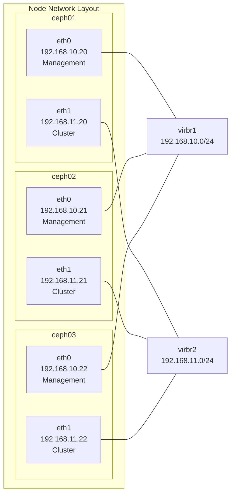

# Ceph Deployment Guide

## Overview

This guide provides step-by-step instructions for deploying a production-ready Ceph storage cluster using Ansible automation. The deployment follows a phased approach for better control, debugging, and reliability.

## Prerequisites

### Infrastructure Requirements

| Component | Specification | Notes |
|-----------|---------------|-------|
| Nodes | 3x Virtual Machines | ceph01, ceph02, ceph03 |
| Memory | 8GB per node | Minimum for production workloads |
| vCPUs | 2 per node | Adequate for test/dev environments |
| System Disk | 50GB per node | OS and container images |
| OSD Disk | 100GB per node (`/dev/vdb`) | Primary data storage |
| DB/WAL Disk | 50GB per node (`/dev/vdc`) | Metadata and write-ahead logs |

### Network Configuration



### Software Prerequisites

#### Control Node Requirements

| Software | Version | Purpose |
|----------|---------|---------|
| Ansible | 2.12+ | Infrastructure automation |
| Python | 3.8+ | Ansible runtime dependency |
| Collections | `ceph.automation`, `community.general`, `ansible.posix` | Ansible modules |
| SSH Access | Key-based | Passwordless access to all nodes |

#### Target System Requirements

| Component | Requirement |
|-----------|-------------|
| OS | Debian 12 |
| Architecture | x86_64 |
| Container Runtime | Podman |
| Time Sync | chrony |

## Pre-Deployment Setup

### 1. Prepare Control Node

#### Install Ansible and Dependencies

```bash
# Install Ansible and Python dependencies
pip3 install ansible

# Install required Ansible collections
ansible-galaxy install -r requirements.yaml

# Verify collection installation
ansible-galaxy collection list | grep -E "(ceph|community|ansible)"
```

### 2. Pre-deployment Validation

#### Test Ansible Connectivity

```bash
# Navigate to Ansible directory
cd jarvis-kvm/ansible

# Test connectivity to all nodes
ansible all -i inventories/development/hosts.yaml -m ping
```

Expected Output:
```yaml
ceph01 | SUCCESS => {
    "ansible_facts": {
        "discovered_interpreter_python": "/usr/bin/python3"
    },
    "changed": false,
    "ping": "pong"
}
```

#### Validate Infrastructure

```bash
# Verify disk layout on all nodes
ansible all -i inventories/development/hosts.yaml -m shell -a "lsblk"

# Check network interface configuration
ansible all -i inventories/development/hosts.yaml -m shell -a "ip addr show"

# Verify system resources
ansible all -i inventories/development/hosts.yaml -m shell -a "free -h && df -h"
```

## Deployment Process
The deployment follows a phased approach for reliability and debugging:

### Phase 1: System Preparation

```bash
# Configure system prerequisites and repositories
ansible-playbook -i inventories/development/hosts.yaml site.yaml --tags preflight
```

#### What Phase 1 Accomplishes

| Task | Description |
|------|-------------|
| DNS Resolution | Configures `/etc/hosts` with cluster node mappings |
| Time Sync | Installs and configures chrony for cluster synchronization |
| Container Runtime | Installs Podman for containerized Ceph services |
| Repositories | Adds Ceph community repositories |
| Base Packages | Installs cephadm, firewalld, and dependencies |
| Network Config | Prepares firewall rules for Ceph services |

#### Verification

```bash
# Verify time synchronization
ansible all -i inventories/development/hosts.yaml -m shell -a "chronyc sources -v"

# Check Podman installation
ansible all -i inventories/development/hosts.yaml -m shell -a "podman --version"
```

!!! note
    Recommended: Use local NTP server for production environment

### Phase 2: Cluster Bootstrap

```bash
# Initialize the Ceph cluster on the admin node
ansible-playbook -i inventories/development/hosts.yaml site.yaml --tags bootstrap --ask-vault-pass
```

!!! info
    All variables are stored under `inventories/development/group_vars`. Use this command to encrypt and view the encrypted vault:
    ```
    ansible-vault encrypt inventories/development/group_vars/admin.yaml
    ansible-vault view inventories/development/group_vars/admin.yaml

    # dashboard_user: admin
    # dashboard_password: b0b0yb0ys3cr3t
    # fsid: 47c6b1da-6271-43a2-9e52-50183ee3fa7e
    ```

#### Bootstrap Process

| Step | Action | Details |
|------|--------|---------|
| 1. Cluster Init | Initialize cluster on ceph01 | FSID: `47c6b1da-6271-43a2-9e52-50183ee3fa7e` |
| 2. Network Config | Configure dual networks | Public: `192.168.10.0/24`, Cluster: `192.168.11.0/24` |
| 3. Dashboard Setup | Enable management dashboard | HTTPS on port 8443 with admin user |
| 4. Base Config | Apply cluster-wide settings | Performance tuning and security |

#### Verification

```bash
# Check initial cluster status
ansible admin -i inventories/development/hosts.yaml -b -m shell -a "ceph -s"
```

Expected Output:
```
cluster:
  id:     47c6b1da-6271-43a2-9e52-50183ee3fa7e
  health: HEALTH_WARN (1 failed)

services:
  mon: 1 daemons, quorum ceph01 (age 5m)
  mgr: ceph01.abcdef(active, since 4m)
```
!!! note
    `HEALTH_WARN` is expected at this stage as additional services are not yet deployed.

### Phase 3: Cluster Expansion

```bash
# Distribute cephadm SSH keys between nodes and add all nodes to cluster with appropriate labels
ansible-playbook -i inventories/development/hosts.yaml site.yaml --tags add_nodes --ask-vault-pass
```

!!! info
    Applied node roles:
    - ceph01: `_admin`, `mon`, `mgr`, `osd`, `rgw`
    - ceph02: `mon`, `mgr`, `osd`, `rgw`
    - ceph03: `mon`, `mgr`, `osd`, `rgw`

### Phase 4: Service Deployment

#### Step 4.1: Core Services
```bash
# Deploy MON, MGR, and RGW services
ansible-playbook -i inventories/development/hosts.yaml site.yaml --tags deploy_services --ask-vault-pass
```

!!! info
    Deployed services:
    - 3x MON: Cluster state management
    - 3x MGR: Cluster management and dashboard
    - 3x RGW: Object storage gateway

#### Step 4.2: OSD Deployment
```bash
# Configure and deploy Object Storage Daemons
ansible-playbook -i inventories/development/hosts.yaml site.yaml --tags configure_osds --ask-vault-pass
```
!!! info
    OSD configuration:
    - Data Device: `/dev/vdb` (100GB per node)
    - DB Device: `/dev/vdc` (50GB per node)
    - Total OSDs: 6 (2 per node)

### Phase 5: Storage Configuration

```bash
# Create storage pools for different use cases
ansible-playbook -i inventories/development/hosts.yaml site.yaml --tags configure_pools --ask-vault-pass
```
!!! info
    Created some ceph pools:
    - kubernetes
    - rbd_ec
    - data pool for RGW

## Complete Deployment

### Single Command Deployment

For experienced users or automated deployments:

```bash
# Deploy entire cluster in one run
ansible-playbook -i inventories/development/hosts.yaml site.yaml --ask-vault-pass

# Deploy with verbose output for troubleshooting
ansible-playbook -i inventories/development/hosts.yaml site.yaml --ask-vault-pass -v
```

!!! note
    Recommended: Use phased deployment for first-time deployments or troubleshooting.

## Deployment Verification

### Cluster Health Check

```bash
# Basic health verification
ansible admin -i inventories/development/hosts.yaml -b -m shell -a "ceph -s"
```

Expected Output (Healthy Cluster):
```
cluster:
  id:     47c6b1da-6271-43a2-9e52-50183ee3fa7e
  health: HEALTH_OK
 
services:
  mon: 3 daemons, quorum ceph01,ceph02,ceph03 (age 2h)
  mgr: ceph01.abcdef(active, since 2h), standbys: ceph02.ghijkl, ceph03.mnopqr
  osd: 6 osds: 6 up (since 2h), 6 in (since 2h)
  rgw: 3 daemons active (3 hosts, 1 zones)
 
data:
  pools:   9 pools, 193 pgs
  objects: 229 objects, 454 KiB
  usage:   150 GiB used, 300 GiB / 450 GiB avail
  pgs:     193 active+clean
```

### Service Status Verification

```bash
# Check all deployed services
ansible admin -i inventories/development/hosts.yaml -b -m shell -a "ceph orch ps"

# Verify service placement
ansible admin -i inventories/development/hosts.yaml -b -m shell -a "ceph orch ls"
```

### Storage Pool Verification

```bash
# List all pools with details
ansible admin -i inventories/development/hosts.yaml -b -m shell -a "ceph osd pool ls detail"

# Check storage usage by pool
ansible admin -i inventories/development/hosts.yaml -b -m shell -a "ceph df"

# Verify OSD tree
ansible admin -i inventories/development/hosts.yaml -b -m shell -a "ceph osd tree"
```

## Post-Deployment Configuration

### Dashboard Access

| Setting | Value |
|---------|-------|
| URL | https://192.168.10.20:8443 |
| Username | `admin` |
| Password | (configured in Ansible vault) |
| Certificate | Self-signed (accept browser warning) |

### Security Considerations

```bash
# Change default dashboard password
ceph dashboard ac-user-set-password admin <new-password>

# Enable SSL certificate (optional)
ceph dashboard set-ssl-certificate -i /path/to/certificate.crt
ceph dashboard set-ssl-certificate-key -i /path/to/private.key
```

## Next Steps

After successful deployment:

1. [Configure Kubernetes Integration](integrations/kubernetes.md) - Set up CSI driver for dynamic provisioning
2. Create S3 Users - Configure object storage access