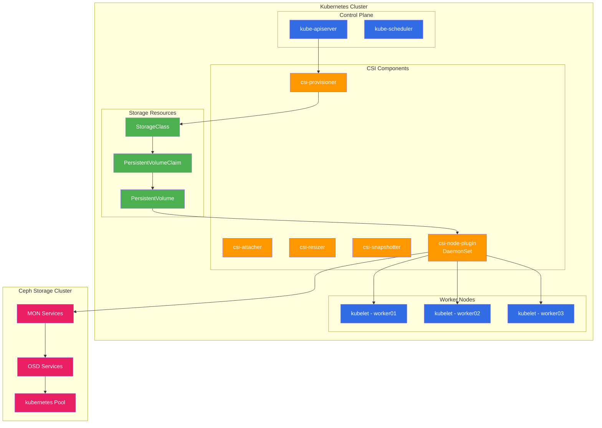

# Kubernetes Integration Guide

## Overview

This guide details the integration of Ceph storage with Kubernetes, providing persistent storage for applications using the Ceph CSI (Container Storage Interface) driver. The integration supports both RBD (block storage) and CephFS (shared filesystem) volumes.

## Architecture Overview



## Prerequisites

### **Ceph Cluster Requirements**
- Functional Ceph cluster with at least one pool
- Admin keyring access
- Network connectivity from Kubernetes nodes to Ceph cluster

### **Kubernetes Requirements**
- Kubernetes 1.20+ with CSI support
- Feature gates enabled: `VolumeSnapshotDataSource`, `ExpandCSIVolumes`
- Node access to Ceph client packages

## Installation

### **Step 1: Install Ceph Client Packages**

```bash
# Install on all Kubernetes nodes
ansible workers -m package -a "name=ceph-common state=present"

# Verify installation
ceph --version
```

### **Step 2: Create Ceph Configuration**

#### **Minimal Ceph Configuration**
```bash
# Generate minimal config on Ceph admin node
ceph config generate-minimal-conf > ceph.conf

# Content should look like:
cat ceph.conf
```
```ini
[global]
    fsid = 47c6b1da-6271-43a2-9e52-50183ee3fa7e
    mon_host = 192.168.10.20:6789,192.168.10.21:6789,192.168.10.22:6789
```

#### **Create Kubernetes Secret**
```bash
# Create namespace for CSI driver
kubectl create namespace ceph-csi-rbd

# Create config secret
kubectl create secret generic ceph-config \
  --from-file=ceph.conf=ceph.conf \
  --namespace=ceph-csi-rbd
```

### **Step 3: Create Ceph User for Kubernetes**

```bash
# Create dedicated Kubernetes user on Ceph cluster
ceph auth get-or-create client.kubernetes \
  mon 'profile rbd' \
  osd 'profile rbd pool=kubernetes' \
  mgr 'profile rbd pool=kubernetes'

# Export keyring
ceph auth export client.kubernetes > ceph.client.kubernetes.keyring
```

#### **Create Authentication Secret**
```bash
# Get user key
CEPH_KEY=$(ceph auth get client.kubernetes | grep key | awk '{print $3}')

# Create Kubernetes secret
kubectl create secret generic csi-rbd-secret \
  --from-literal=userID=kubernetes \
  --from-literal=userKey=$CEPH_KEY \
  --namespace=ceph-csi-rbd

# Also create in kube-system for StorageClass
kubectl create secret generic csi-rbd-secret \
  --from-literal=userID=kubernetes \
  --from-literal=userKey=$CEPH_KEY \
  --namespace=kube-system
```

### **Step 4: Deploy Ceph CSI Driver**

#### **Add Ceph CSI Helm Repository**
```bash
helm repo add ceph-csi https://ceph.github.io/csi-charts
helm repo update
```

#### **Create Values File**
```yaml
# values-ceph-csi-rbd.yaml
csiConfig:
  - clusterID: "47c6b1da-6271-43a2-9e52-50183ee3fa7e"
    monitors:
      - "192.168.10.20:6789"
      - "192.168.10.21:6789"
      - "192.168.10.22:6789"

storageClass:
  create: true
  name: ceph-rbd
  clusterID: "47c6b1da-6271-43a2-9e52-50183ee3fa7e"
  pool: kubernetes
  imageFormat: "2"
  imageFeatures: layering
  csi.storage.k8s.io/provisioner-secret-name: csi-rbd-secret
  csi.storage.k8s.io/provisioner-secret-namespace: kube-system
  csi.storage.k8s.io/controller-expand-secret-name: csi-rbd-secret
  csi.storage.k8s.io/controller-expand-secret-namespace: kube-system
  csi.storage.k8s.io/node-stage-secret-name: csi-rbd-secret
  csi.storage.k8s.io/node-stage-secret-namespace: kube-system
  allowVolumeExpansion: true
  reclaimPolicy: Delete
  mountOptions: []

secret:
  create: true
  name: csi-rbd-secret
  userID: kubernetes
  userKey: <CEPH_KEY>

cephconf: |
  [global]
    auth_cluster_required = cephx
    auth_service_required = cephx
    auth_client_required = cephx
```

#### **Install CSI Driver**
```bash
# Install RBD CSI driver
helm install ceph-csi-rbd ceph-csi/ceph-csi-rbd \
  --namespace ceph-csi-rbd \
  --values values-ceph-csi-rbd.yaml

# Verify installation
kubectl get pods -n ceph-csi-rbd
```

## Storage Classes

### **RBD Storage Class**

```yaml
apiVersion: storage.k8s.io/v1
kind: StorageClass
metadata:
  name: ceph-rbd
  annotations:
    storageclass.kubernetes.io/is-default-class: "true"
provisioner: rbd.csi.ceph.com
parameters:
  clusterID: 47c6b1da-6271-43a2-9e52-50183ee3fa7e
  pool: kubernetes
  imageFormat: "2"
  imageFeatures: layering
  csi.storage.k8s.io/provisioner-secret-name: csi-rbd-secret
  csi.storage.k8s.io/provisioner-secret-namespace: kube-system
  csi.storage.k8s.io/controller-expand-secret-name: csi-rbd-secret
  csi.storage.k8s.io/controller-expand-secret-namespace: kube-system
  csi.storage.k8s.io/node-stage-secret-name: csi-rbd-secret
  csi.storage.k8s.io/node-stage-secret-namespace: kube-system
  csi.storage.k8s.io/fstype: ext4
reclaimPolicy: Delete
allowVolumeExpansion: true
mountOptions:
  - discard
```

### **High-Performance Storage Class**

```yaml
apiVersion: storage.k8s.io/v1
kind: StorageClass
metadata:
  name: ceph-rbd-fast
provisioner: rbd.csi.ceph.com
parameters:
  clusterID: 47c6b1da-6271-43a2-9e52-50183ee3fa7e
  pool: kubernetes
  imageFormat: "2"
  imageFeatures: layering,fast-diff,object-map,deep-flatten,exclusive-lock
  csi.storage.k8s.io/provisioner-secret-name: csi-rbd-secret
  csi.storage.k8s.io/provisioner-secret-namespace: kube-system
  csi.storage.k8s.io/controller-expand-secret-name: csi-rbd-secret
  csi.storage.k8s.io/controller-expand-secret-namespace: kube-system
  csi.storage.k8s.io/node-stage-secret-name: csi-rbd-secret
  csi.storage.k8s.io/node-stage-secret-namespace: kube-system
  csi.storage.k8s.io/fstype: ext4
reclaimPolicy: Retain
allowVolumeExpansion: true
volumeBindingMode: WaitForFirstConsumer
mountOptions:
  - discard
  - noatime
```

### **Backup Storage Class (Erasure Coded)**

```yaml
apiVersion: storage.k8s.io/v1
kind: StorageClass
metadata:
  name: ceph-rbd-ec
provisioner: rbd.csi.ceph.com
parameters:
  clusterID: 47c6b1da-6271-43a2-9e52-50183ee3fa7e
  pool: rbd_ec
  dataPool: rbd_ec
  imageFormat: "2"
  imageFeatures: layering
  csi.storage.k8s.io/provisioner-secret-name: csi-rbd-secret
  csi.storage.k8s.io/provisioner-secret-namespace: kube-system
  csi.storage.k8s.io/controller-expand-secret-name: csi-rbd-secret
  csi.storage.k8s.io/controller-expand-secret-namespace: kube-system
  csi.storage.k8s.io/node-stage-secret-name: csi-rbd-secret
  csi.storage.k8s.io/node-stage-secret-namespace: kube-system
  csi.storage.k8s.io/fstype: ext4
reclaimPolicy: Retain
allowVolumeExpansion: true
```

## Usage Examples

### **Simple Persistent Volume Claim**

```yaml
apiVersion: v1
kind: PersistentVolumeClaim
metadata:
  name: mysql-data
  namespace: default
spec:
  accessModes:
    - ReadWriteOnce
  storageClassName: ceph-rbd
  resources:
    requests:
      storage: 10Gi
```

### **Database Deployment with Persistent Storage**

```yaml
apiVersion: apps/v1
kind: Deployment
metadata:
  name: mysql
  namespace: default
spec:
  replicas: 1
  selector:
    matchLabels:
      app: mysql
  template:
    metadata:
      labels:
        app: mysql
    spec:
      containers:
      - name: mysql
        image: mysql:8.0
        env:
        - name: MYSQL_ROOT_PASSWORD
          value: "securepassword"
        - name: MYSQL_DATABASE
          value: "testdb"
        ports:
        - containerPort: 3306
          name: mysql
        volumeMounts:
        - name: mysql-storage
          mountPath: /var/lib/mysql
        resources:
          limits:
            memory: "1Gi"
            cpu: "500m"
          requests:
            memory: "512Mi"
            cpu: "250m"
      volumes:
      - name: mysql-storage
        persistentVolumeClaim:
          claimName: mysql-data
```

### **StatefulSet with Dynamic Provisioning**

```yaml
apiVersion: apps/v1
kind: StatefulSet
metadata:
  name: web
  namespace: default
spec:
  serviceName: "web"
  replicas: 3
  selector:
    matchLabels:
      app: web
  template:
    metadata:
      labels:
        app: web
    spec:
      containers:
      - name: nginx
        image: nginx:1.21
        ports:
        - containerPort: 80
          name: web
        volumeMounts:
        - name: www
          mountPath: /usr/share/nginx/html
  volumeClaimTemplates:
  - metadata:
      name: www
    spec:
      accessModes: ["ReadWriteOnce"]
      storageClassName: ceph-rbd
      resources:
        requests:
          storage: 5Gi
```

## Volume Snapshots

### **Install Snapshot Controller**

```bash
# Install snapshot CRDs
kubectl apply -f https://raw.githubusercontent.com/kubernetes-csi/external-snapshotter/release-6.0/client/config/crd/snapshot.storage.k8s.io_volumesnapshotclasses.yaml
kubectl apply -f https://raw.githubusercontent.com/kubernetes-csi/external-snapshotter/release-6.0/client/config/crd/snapshot.storage.k8s.io_volumesnapshotcontents.yaml
kubectl apply -f https://raw.githubusercontent.com/kubernetes-csi/external-snapshotter/release-6.0/client/config/crd/snapshot.storage.k8s.io_volumesnapshots.yaml

# Install snapshot controller
kubectl apply -f https://raw.githubusercontent.com/kubernetes-csi/external-snapshotter/release-6.0/deploy/kubernetes/snapshot-controller/rbac-snapshot-controller.yaml
kubectl apply -f https://raw.githubusercontent.com/kubernetes-csi/external-snapshotter/release-6.0/deploy/kubernetes/snapshot-controller/setup-snapshot-controller.yaml
```

### **Volume Snapshot Class**

```yaml
apiVersion: snapshot.storage.k8s.io/v1
kind: VolumeSnapshotClass
metadata:
  name: ceph-rbd-snapshot
driver: rbd.csi.ceph.com
deletionPolicy: Delete
parameters:
  clusterID: 47c6b1da-6271-43a2-9e52-50183ee3fa7e
  csi.storage.k8s.io/snapshotter-secret-name: csi-rbd-secret
  csi.storage.k8s.io/snapshotter-secret-namespace: kube-system
```

### **Create Volume Snapshot**

```yaml
apiVersion: snapshot.storage.k8s.io/v1
kind: VolumeSnapshot
metadata:
  name: mysql-data-snapshot
  namespace: default
spec:
  volumeSnapshotClassName: ceph-rbd-snapshot
  source:
    persistentVolumeClaimName: mysql-data
```

### **Restore from Snapshot**

```yaml
apiVersion: v1
kind: PersistentVolumeClaim
metadata:
  name: mysql-data-restored
  namespace: default
spec:
  accessModes:
    - ReadWriteOnce
  storageClassName: ceph-rbd
  dataSource:
    name: mysql-data-snapshot
    kind: VolumeSnapshot
    apiGroup: snapshot.storage.k8s.io
  resources:
    requests:
      storage: 10Gi
```

## Monitoring and Troubleshooting

### **Check CSI Driver Status**

```bash
# Check CSI pods
kubectl get pods -n ceph-csi-rbd

# Check CSI driver logs
kubectl logs -n ceph-csi-rbd deployment/ceph-csi-rbd-provisioner
kubectl logs -n ceph-csi-rbd daemonset/ceph-csi-rbd-nodeplugin

# Check storage classes
kubectl get storageclass

# Check persistent volumes
kubectl get pv
```

### **Common Issues**

#### **Pod Cannot Mount Volume**

**Symptoms:**
```
MountVolume.MountDevice failed: rbd: map failed with: rbd: sysfs write failed
```

**Resolution:**
```bash
# Check RBD kernel module
modprobe rbd

# Verify Ceph connectivity
ceph -s --cluster ceph --conf /etc/ceph/ceph.conf --keyring /etc/ceph/ceph.client.kubernetes.keyring

# Check node access to Ceph
rbd ls kubernetes --keyring /etc/ceph/ceph.client.kubernetes.keyring
```

#### **Provisioning Failures**

**Symptoms:**
```
Failed to provision volume: rpc error: code = Internal desc = failed to create image
```

**Resolution:**
```bash
# Check Ceph pool status
ceph osd pool ls detail

# Verify pool has rbd application enabled
ceph osd pool application enable kubernetes rbd

# Check user permissions
ceph auth get client.kubernetes
```

### **Performance Tuning**

#### **RBD Cache Settings**
```bash
# Enable RBD cache on all nodes
echo 'rbd_cache = true' >> /etc/ceph/ceph.conf
echo 'rbd_cache_size = 67108864' >> /etc/ceph/ceph.conf
echo 'rbd_cache_writethrough_until_flush = true' >> /etc/ceph/ceph.conf
```

#### **Mount Options Optimization**
```yaml
# Optimized storage class for performance
mountOptions:
  - discard      # Enable TRIM
  - noatime      # Disable access time updates
  - nodiratime   # Disable directory access time
```

## Advanced Features

### **Volume Expansion**

```bash
# Expand PVC (requires allowVolumeExpansion: true)
kubectl patch pvc mysql-data -p '{"spec":{"resources":{"requests":{"storage":"20Gi"}}}}'

# Verify expansion
kubectl get pvc mysql-data
```

### **Cross-Namespace Snapshots**

```yaml
# Snapshot in different namespace
apiVersion: snapshot.storage.k8s.io/v1
kind: VolumeSnapshot
metadata:
  name: cross-ns-snapshot
  namespace: backup
spec:
  volumeSnapshotClassName: ceph-rbd-snapshot
  source:
    persistentVolumeClaimName: mysql-data
    namespace: default  # Source namespace
```

### **Volume Cloning**

```yaml
# Clone existing PVC
apiVersion: v1
kind: PersistentVolumeClaim
metadata:
  name: mysql-data-clone
  namespace: default
spec:
  accessModes:
    - ReadWriteOnce
  storageClassName: ceph-rbd
  dataSource:
    name: mysql-data
    kind: PersistentVolumeClaim
  resources:
    requests:
      storage: 10Gi
```

## Backup and Disaster Recovery

### **Automated Backup with CronJob**

```yaml
apiVersion: batch/v1
kind: CronJob
metadata:
  name: volume-backup
  namespace: default
spec:
  schedule: "0 2 * * *"  # Daily at 2 AM
  jobTemplate:
    spec:
      template:
        spec:
          containers:
          - name: backup
            image: ceph/ceph:v17
            command:
            - /bin/sh
            - -c
            - |
              rbd snap create kubernetes/pvc-mysql-data@backup-$(date +%Y%m%d)
              rbd snap protect kubernetes/pvc-mysql-data@backup-$(date +%Y%m%d)
              # Export to external storage
              rbd export-diff kubernetes/pvc-mysql-data@backup-$(date +%Y%m%d) \
                /backup/mysql-data-$(date +%Y%m%d).diff
            volumeMounts:
            - name: backup-storage
              mountPath: /backup
            env:
            - name: CEPH_ARGS
              value: "--keyring /etc/ceph/ceph.client.kubernetes.keyring"
          volumes:
          - name: backup-storage
            nfs:
              server: backup-server.example.com
              path: /backups/ceph
          restartPolicy: OnFailure
```

## Best Practices

### **Performance Optimization**

1. **Use appropriate image features**: Enable only needed RBD features
2. **Optimize mount options**: Use `discard`, `noatime` for better performance
3. **Size pools correctly**: Ensure adequate PG distribution
4. **Monitor storage usage**: Set up alerts for capacity and performance

### **Security**

1. **Least privilege**: Create dedicated users with minimal required permissions
2. **Network isolation**: Use network policies to restrict access
3. **Encryption**: Enable encryption at rest for sensitive data
4. **Regular rotation**: Rotate Ceph authentication keys periodically

### **Operational**

1. **Regular testing**: Test backup and restore procedures
2. **Monitor health**: Set up monitoring for CSI driver and Ceph cluster
3. **Capacity planning**: Monitor growth trends and plan expansion
4. **Documentation**: Keep integration documentation updated

This integration provides enterprise-grade persistent storage for Kubernetes workloads with high availability, performance, and data durability.