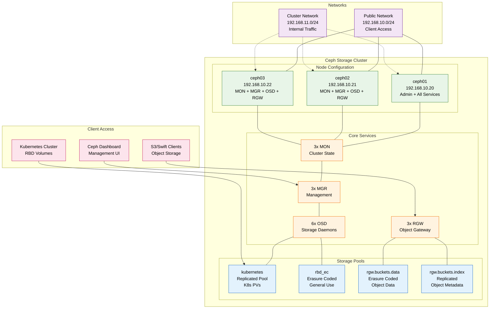

# Ceph Storage Overview

## Introduction

This documentation covers the Ceph distributed storage system deployed in the infra-lab environment. Ceph provides a unified storage platform that delivers block, object, and file storage services with enterprise-grade reliability, scalability, and performance.

## Architecture Summary

## Cluster Specifications

| Component | Details |
|-----------|---------|
| **Version** | Ceph Squid (Community Edition) |
| **Cluster ID** | `47c6b1da-6271-43a2-9e52-50183ee3fa7e` |
| **Nodes** | 3 (ceph01, ceph02, ceph03) |
| **Raw Storage** | 300GB (100GB per node) |
| **Usable Storage** | ~200GB (with 3x replication) |
| **Replication Factor** | 3x for critical data |
| **Erasure Coding** | k=2, m=1 (66% storage efficiency) |

## Network Architecture

### Dual Network Design

Ceph uses separate networks for optimal performance and security:

| Network Type | CIDR | Purpose | Interface |
|--------------|------|---------|-----------|
| **Public Network** | `192.168.10.0/24` | Client access, management, monitors | `eth0` |
| **Cluster Network** | `192.168.11.0/24` | OSD replication, recovery, heartbeat | `eth1` |

!!! note
    The cluster network handles high-volume internal traffic, keeping client operations on the public network responsive.

### Node Configuration

| Node | Public IP | Cluster IP | Services |
|------|-----------|------------|----------|
| **ceph01** | `192.168.10.20` | `192.168.11.20` | Admin, MON, MGR, OSD, RGW |
| **ceph02** | `192.168.10.21` | `192.168.11.21` | MON, MGR, OSD, RGW |
| **ceph03** | `192.168.10.22` | `192.168.11.22` | MON, MGR, OSD, RGW |

## Storage Pools

The cluster provides different storage pools optimized for specific use cases:

### Block Storage Pools

| Pool Name | Type | Replication/EC | PGs | Use Case |
|-----------|------|----------------|-----|----------|
| `kubernetes` | Replicated | 3x | 64 | Kubernetes persistent volumes |
| `rbd_ec` | Erasure Coded | k=2, m=1 | 64 | General block storage (space-efficient) |

### Object Storage Pools

| Pool Name | Type | Replication/EC | PGs | Use Case |
|-----------|------|----------------|-----|----------|
| `default.rgw.buckets.data` | Erasure Coded | k=2, m=1 | 64 | S3 object data storage |
| `default.rgw.buckets.index` | Replicated | 3x | 32 | S3 bucket metadata and indexes |

> **Pool Selection Guide**:
> - **Replicated pools**: Better performance, higher storage overhead (3x)
> - **Erasure coded pools**: Lower storage overhead (1.5x), slightly higher latency

## Access Methods

### Management Dashboard
- **URL**: https://192.168.10.20:8443
- **Username**: `admin`
- **Features**: Cluster monitoring, pool management, OSD operations, performance metrics

### Object Storage (S3)
- **Endpoint**: http://192.168.10.20:80
- **Compatibility**: AWS S3 API compatible
- **Features**: Bucket management, access policies, multi-user support

## Getting Started

1. **[Deployment Guide](deployment.md)** - Complete installation and configuration
2. **[Kubernetes Integration](integrations/kubernetes.md)** - CSI driver setup and usage examples